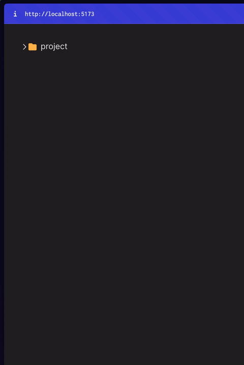

<p align="center">
  <h1 align="center"><b>AiB Take Home: File Tree Component</b></h1>
</p>
  
<!-- TABLE OF CONTENTS -->
<details open="open">
  <summary>Table of Contents</summary>
  <ol>
    <li><a href="#overview">Overview</a></li>
    <li><a href="#installation--getting-started">Installation / Getting Started</a></li>
    <li><a href="#design--engineering decisions">Design / Engineering Decisions</a></li>
    <li><a href="#potential-improvements">Potential Improvements</a></li>
  </ol>
</details>

## <b>Overview</b>

<p align="left">
File Tree UI component that allows the user to browse a directory structure and interact with files and folders.
</p>



## <b>Installation / Getting Started</b>

Perform the following steps to install aib-take-home locally:

1. Clone this AiB Take Home repository onto your local machine.
2. Open aib-take-home repo in VS Code or your favorite IDE.
3. In the root folder, install dependencies by running the command:

   ```
   npm install
   ```

4. Then run the following command to start up the development server for the project:
   ```
   npm run dev
   ```

## <b>Design / Engineering Decisions </b>

**1. Using recesurive calls for FileTree component**

**Rationale:**<br> File trees typically are hierarchical and have nested levels. Using recursive calls for the FileTree component allows rendering of the file tree structure dynamically regardless of how deep the tree is, making the component reusable for other contexts.
<br>
<br>

**2. Managing state of selected directory and selected file**

**Rationale:**<br> Managing the state of selected directory and selected file is for tracking user interaction, to provide user feedback by highlighting the selected directory or file within the tree. By managing the state of selected directory separate from selected file, the application can handle user actions with more customizability between selecting files or directories.  
<br>
<br>
**3. Managing state for `selectedFile` and `selectedDirectory` using useState within App.tsx versus FileTree.tsx.**

**Rationale:**<br> The 'FileTree' component is used recursively to render subdirectories and files within directories. Each instance of 'FileTree' component needs access to the same `selectedFile` and `selectedDirectory` state, to maintain consistent selection across entire tree. Managing state in higher-level component App.tsx, ensures all instances of 'FileTree' have access to the same state.
<br>
<br>

**4. Visual cues for collapsed or expanded directories (folders)**

**Rationale:**<br> To ensure the UI is intuitive and usable, when directory changes from collapsed to expanded, the following will occur:

- the caret icon will change from pointing rightward to downward
- the folder icon will change from closed to open

Vice-versa will occur when directory changes from expanded to collapsed.

## <b>Potential Improvements</b>

1. Instead of using the recursive approach, an iterative approach can be used instead to traverse through the file tree.

   - The iterative approach allows you to create an explicit stack giving you more control of when and how items (directories or files) are pushed and popped from the stack.
   - The recursive approach provides less control due to the nature of having limited control over the call stack, where each recursive function call pushes a new stack frame onto the call stack. However,  
     the rationale for going with the recursive appraoch is to make the code more readable.

2. Create a reuseable for component for rendering icons
